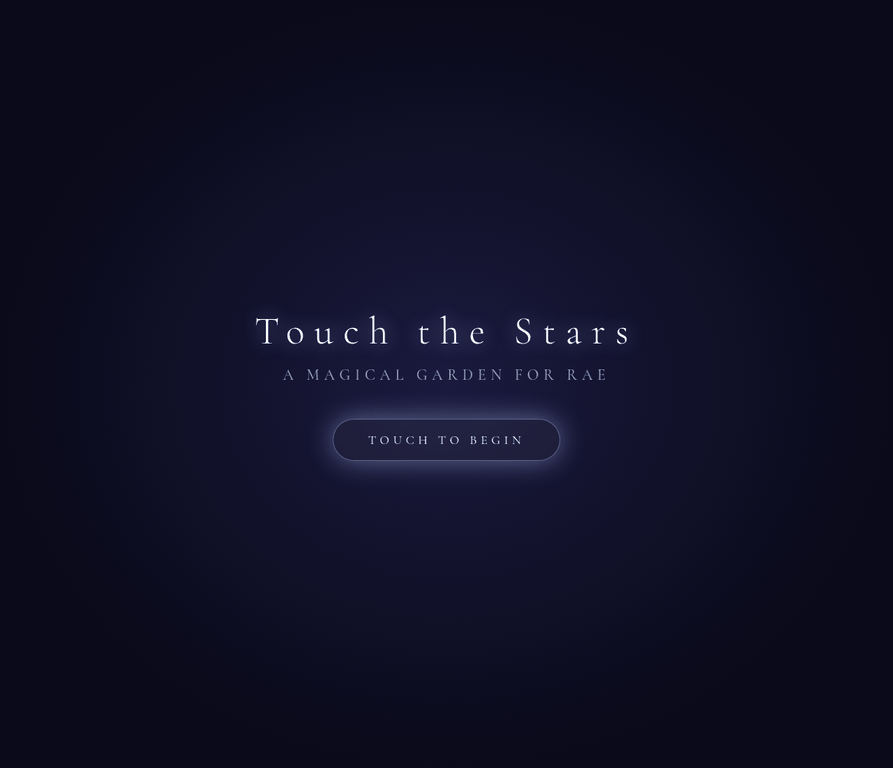
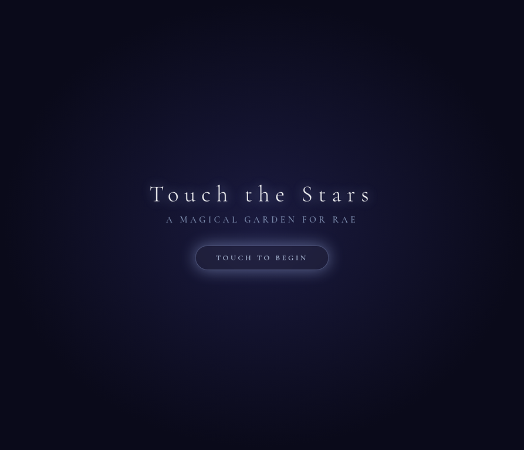
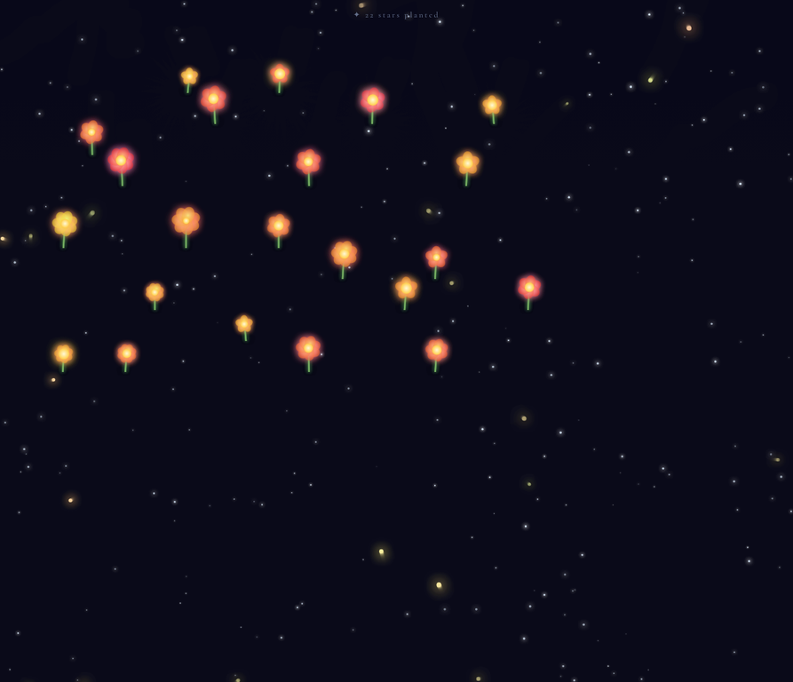
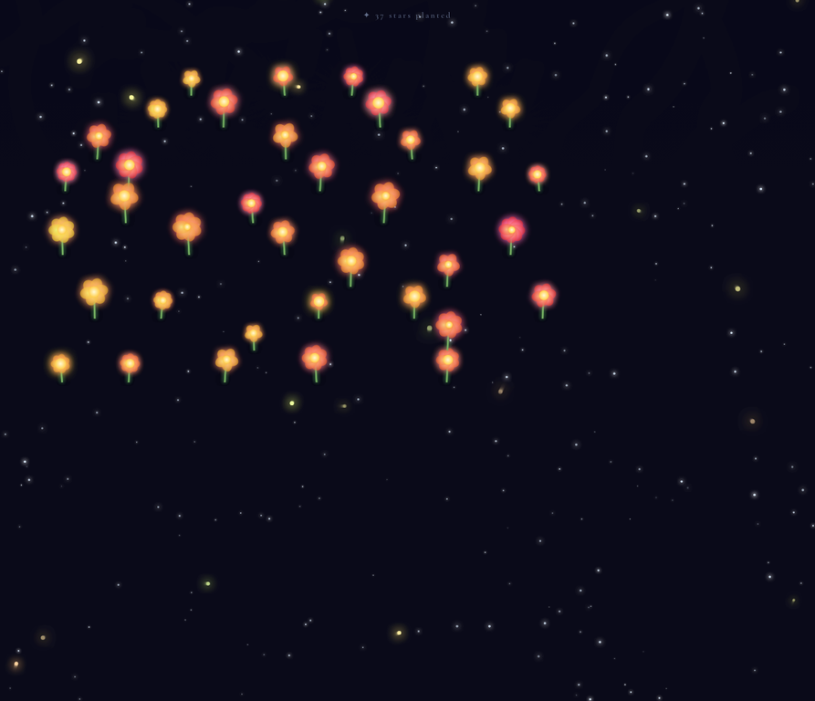

<div align="center">
  
</div>

<h1 align="center">Touch the Stars</h1>

<p align="center">
  <em>A generative art arcade experience built with HTML5 Canvas and JavaScript.</em>
</p>

<p align="center">
  <a href="https://limchinhan123.github.io/voidrunner/"><strong>✨ Play the Live Demo ✨</strong></a>
</p>

---

## 🌟 Overview

**Touch the Stars** is a serene, interactive digital garden where users can paint with light. Built entirely from scratch using native web technologies, it features a custom particle system, fluid animations, and a soothing atmosphere.

The game is designed to be a relaxing, magical experience. With every touch, glowing flowers bloom in a starry void, accompanied by soft trails of stardust and floating, uplifting words.

## 📸 Gallery

<div align="center">
  
  
</div>

<br>

<div align="center">
  
</div>

## 🎮 Controls

The experience is fully responsive and supports both mouse and touch inputs:

- **Plant a Flower:** Click or tap anywhere on the canvas to plant a glowing flower.
- **Paint Stardust:** Click and drag (or swipe) across the screen to leave a shimmering trail of sparkles.

## 🛠️ Technology Stack

This project is a testament to what can be achieved without external libraries or heavy frameworks. It is a single-file browser experience (`index.html`) focusing on performance and lightweight interaction design.

- **HTML5 Canvas:** Powers the entire visual rendering pipeline.
- **Vanilla JavaScript:** Handles the custom physics engine, particle lifecycle, and animation loop.
- **Web Audio API:** *(Supported in the architecture)* Provides immersive audio feedback.
- **GitHub Pages:** Used for seamless deployment and hosting.

## 🧠 Technical Highlights

- **Custom Particle Engine:** A lightweight, custom-built particle system handles the physics (velocity, gravity, drag) and rendering of stars, fireflies, and floral bursts.
- **Generative Art:** Flowers are procedurally generated with randomized petal counts, hues, and sizes, ensuring no two blooms are exactly alike.
- **Responsive Design:** The canvas automatically scales to fit any device, dynamically adjusting particle counts and interaction zones based on screen size and pixel density.

## 🚀 Running Locally

To run the project locally, simply clone the repository and start a local web server:

```bash
git clone https://github.com/limchinhan123/voidrunner.git
cd voidrunner
python3 serve.py
```

Then navigate to `http://127.0.0.1:4899/` in your browser.

---
*This project is part of my portfolio, showcasing my skills in creative coding, particle systems, and client-side interaction design.*
